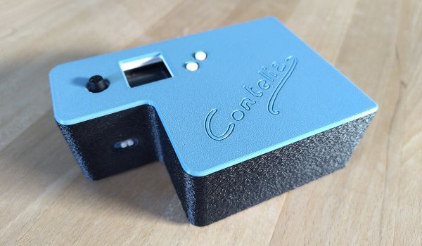

{width=100%}

Les boîtes à histoires du commerce sont très appréciées par les enfants
(et les parents) mais...

Contelia s'en inspire avec une conviction différente : elle doit être libre,
compréhensible, modifiable et évolutive.

Pas de cloud, pas de contenu verrouillé, pas besoin d'une application pour le
smartphone. L'objet vous appartient. Vous pourrez y ajouter les histoires que
vous voulez sans aucune limite à part la capacité de la mémoire sur la carte
micro-SD (qui peut être changée en cas de besoin).

## Evolution

Cette boîte à histoire à un objectif à long terme. Une fois que l'endant est
plus grand, elle doit pouvoir être transformée en (par exemple) simple lecteur
de musique (lecteur mp3), en lecteur de livre audio avec toutes les
fonctionnalités attendues pour un produit plus mature (navigation par phrase,
chapitre, vitesse de lecture variable, ...).

Aujourd'hui c'est une boîte à histoire, les évolutions ne sont pas disponible
pour le moment. Ce projet est avant tout un projet artisanal où son
développement suit quelques conditions :

- Libre autant que possible 
- **Sans IA** : fait par un humain pour les humains  
  _L'objectif n'est pas la productivité à tout prix_
- Dans mon temps libre
- Pour le plaisir

## Libre et open-source

Cette boîte à histoire est aussi libre que possible...

_Logiciel_ : le code source est entièrement disponible, les format de contenu
             sont ouverts et documentés. Elle est aussi compatible avec le format
             propriétaire de Lunii. Le système d'exploitation peut entièrement
             être recompilé par "n'importe qui".

_Matériel_ : elle s'appuie sur des composants standards, modulables et
             remplaçables.

_Boîtier_ : les modèles 3D sont publiés. N'importe qui peut les imprimer ou les
            modifier à sa guise.

## Les composants

- Cerveau : [Raspberry Pi Zero 2 W].
- Interface : carte [Adafruit] avec écran et boutons physiques.
- Alimentation : carte [PiSugar] avec batterie intégrée.
- Son : haut-parleur externe et support du bluetooth.

[Raspberry Pi Zero 2 W]: https://www.raspberrypi.com/products/raspberry-pi-zero-2-w/
[Adafruit]: https://www.adafruit.com/product/4506
[PiSugar]: https://www.pisugar.com/products/pisugar-3-raspberry-pi-zero-battery