## Composants

Avant de commencer, veuillez contrôler que vou disposez bien de tous les
composants de votre boîte à histoire Contelia.

- Eléments imprimés
  - Grande boîte principale (1×)
  - Couvercle de la bôite principale (1×)
  - Boîte à encaster (1×)
  - Couvercle supérieur de la boîte à encaster (1×)
  - Couvercle inférieur de la boîte à encaster (1×)
  - Attache en forme de 8 (1×)
  - Entretoises (4×)
  - Boutons circulaires (2×)
  - Bouton d'alimentation (1×)
- Vitre en plastique (1×)
- Vis nylon (4×)
- Carte Raspberry Pi Zero 2 WH (1×)
- Carte Adafruit 1.3" TFT Bonnet avec son stick en caoutchouc (1×)
- Carte PiSugar 3 avec batterie (1×)
- Haut-parleur USB (1×)
- Câble adaptateur micro-USB / USB (1×)
- Carte micro-SD de 64 GB avec son adaptateur SD (1×)

## Préparation

Avant de commencer le montage à proprement parler, il faut déployer le système
d'exploitation Contelia sur la carte micro-SD. Pour se faire, déballez la carte
et son adaptateur, et en fonction des moyens que vous avez à votre disposition,
introduisez la carte micro-SD dans son adaptateur puis l'adaptateur dans votre
ordinateur, ou utilisez directement un lecteur de carte micro-SD.

Selon votre système d’exploitation, différentes techniques s’offrent à vous pour
déployer l’image sur votre carte micro-SD.

### A. balenaEtcher

Le logiciel [balenaEtcher] est un outil graphique très connu permettant de
facilement déployer une image de ce type depuis chaque plateforme (Linux, macOS
et Windows). À vous de voir si vous souhaitez faire confiance à cet éditeur de
logiciel, tout comme vous me faites confiance pour Contelia OS. Il n’est pas
nécessaire ici que je vous explique comment utiliser ce logiciel, vous devriez
assez vite vous en sortir. Un avantage de l’utiliser par rapport à une ligne de
commande, c’est qu’il y a moins de risques de faire une bêtise en écrivant
l’image sur le mauvais périphérique.

### B. Ligne de commande

Si votre système d’exploitation est Linux ou macOS, je ne recommande pas
l’utilisation de [balenaEtcher] car c’est comme utiliser un canon pour écraser
une mouche. Le déploiement de Contelia OS est très simple et ne nécessite aucune
subtilité. Vous pouvez utiliser (en root comme les vrais) la commande `dd` pour
faire ce travail.

**Linux**

Sous Linux, identifiez l’adresse de votre carte micro-SD avec la commande dmesg.

```
dmesg | grep sd
```

Qui par exemple, pourrait vous retourner ceci :

```
[35574.947414] sd 6:0:0:0: [sde] 249737216 512-byte logical blocks: (128 GB/119 GiB)
[35574.949519] sde: detected capacity change from 0 to 249737216
[35574.981583]  sde: sde1 sde2
```

Ce qui nous indique que la carte est accessible en `/dev/sde`. Faites très
attention avec `dd`. Ne vous mélangez pas les pinceaux avec le `if=` et surtout
le `of=`. Vous allez avoir besoin des droits root et il serait dommage de
détruire un de vos périphériques. Rappelez-vous que `if` signifie Input File, et
`of` signifie Output File.

```
# Veuillez remplacer ici le sdX par le numéro qui correspond à votre carte
dd if=~/carnotzet-os-X.Y.Z-rpi4b.img of=/dev/sdX bs=1M status=progress
```

**macOS**

La bonne nouvelle c’est que sous macOS c’est presque la même chose. Comme avec
Linux, faites attention avec les `if=` et `of=`.

```
diskutil list

# Démontez la carte micro-SD (remplacer diskX par le bon identifiant), puis flashez
diskutil unmountDisk /dev/diskX
sudo dd if=~/carnotzet-os-X.Y.Z-rpi4b.img of=/dev/diskX bs=1m status=progress
```

### Ejection

Comme avec tous périphériques qui se respectent, veuillez éjecter proprement la
carte micro-SD de votre ordinateur. Il faut être sûr que les données sont
correctement écrites. Dans le cas contraire, une fois que votre boîte à histoire
Contelia sera montée, il risquerait de ne rien s'afficher mais nous y
reviendrons plus loin.

## Montage

A partir d'ici, les manipulations vont devoir se faire avec soin et si possible
sans électrocité statique. Si vous ne disposez pas de bracelet anti-statique,
assurez-vous de ne pas porter de vêtements qui favorisent l'électricité statique
tel qu'un pull-over, une jacket ou un vêtement en cuir.

Dans tous les cas, essayez de manipuler les cartes électronique en touchant le
moins possible les contactes et les composants.

### Préparation de la carte Raspberry Pi

Avant tout, insérez la carte micro-SD dans le Raspberry Pi.

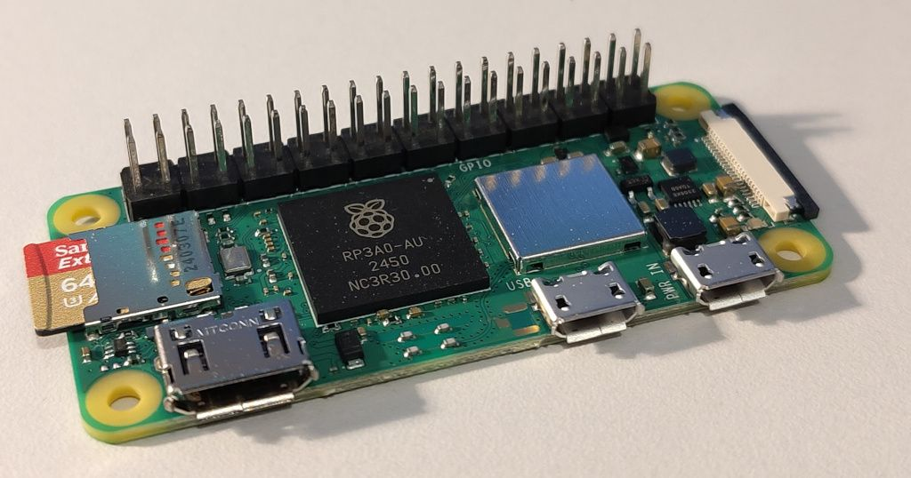{width=100%}

Je vous invite alors à retourner le Raspberry Pi et à inspecter les contactes
tout en haut à droite.

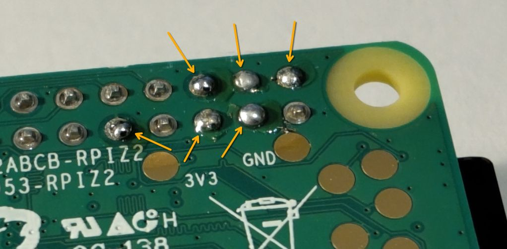{width=100%}

Vous devriez constater que 6 contactes sont légèrement différents où des
soudures ont été refaîtes. En effet, ces 6 contactes vont être appuyés contre la
carte d'alimentation PiSugar qui utilise des bogo-PINs (se sont des PINs montés
sur ressort et qui vont s'appuyer sur les contactes du Raspberry Pi). Si vous ne
constatez pas de différences entre ces contactes et les autres, il est possible
que les connexions avec la carte d'alimentation ne se fassent pas correctement.

### Préparation de la carte PiSugar 3

La carte PiSugar 3 est directement attachée à sa batterie au lithium. Un aimant
permet de maintenir en place la batterie. Si vous déconnectez l'aimant, faîtes
attention de ne pas toucher des contactes de la carte avec la surface circulaire
en acier. Le cas échéant, il pourrait se produire un court-circuit destructeur.

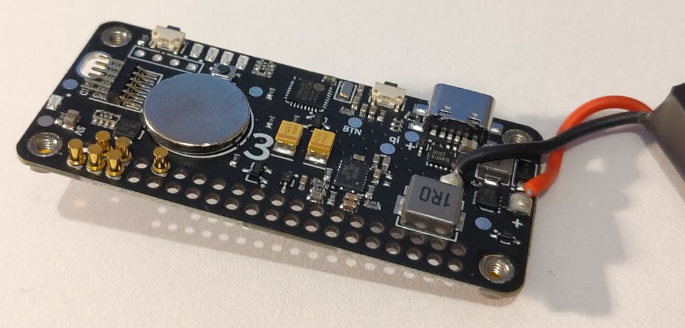{width=100%}

Posez la carte de telle manière que la batterie se situe en dessous. Vous
devriez constater que les 4 trous filetés ont un autocollant semi-transparent
orange collé dessus.

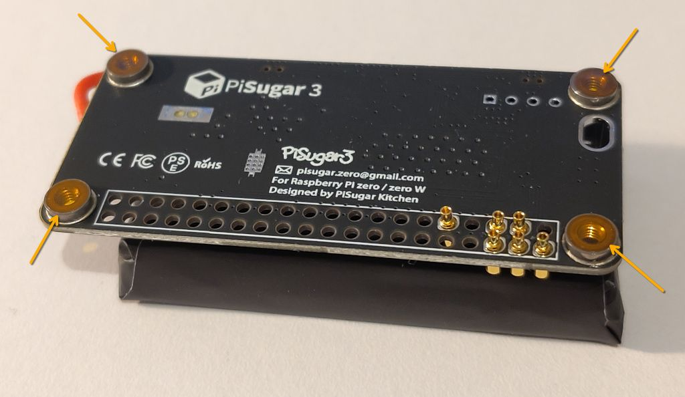{width=100%}

Vous devez enlever ces 4 autocollants sinon il ne sera pas possible de visser
les cartes entre elles le temps venu. Pour y parvenir, utilisez (par exemple) la
lame d'un cutter afin de soulever délicatement chaque autocollant.

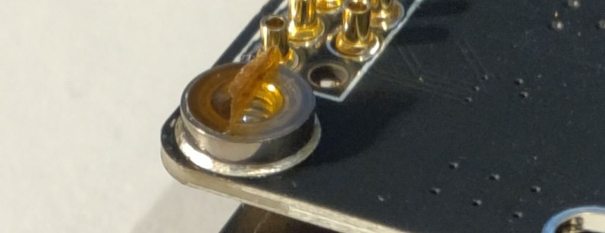{width=100%}

### Assemblage des cartes Raspberry Pi et Adafruit

Pour commencer, l'assemblage des cartes ne concernera que la carte Raspberry Pi
et la carte Adafruit 1.3" TFT Bonnet. N'enlevez pas encore la protection sur
l'écran de la carte Adafruit et laissez le stick de côté pour le moment.

Connectez délicatement la carte Adafruit avec la carte Raspberry Pi. Pour se
faire, introduisez doucement le connecteur en veillant à ne pas appuyer avec vos
doigts sur l'écran. Il serait dommage de l'abimer avec cette manipulation.
Utilisez les zones libres du PCB comme appuis et prennez votre temps.

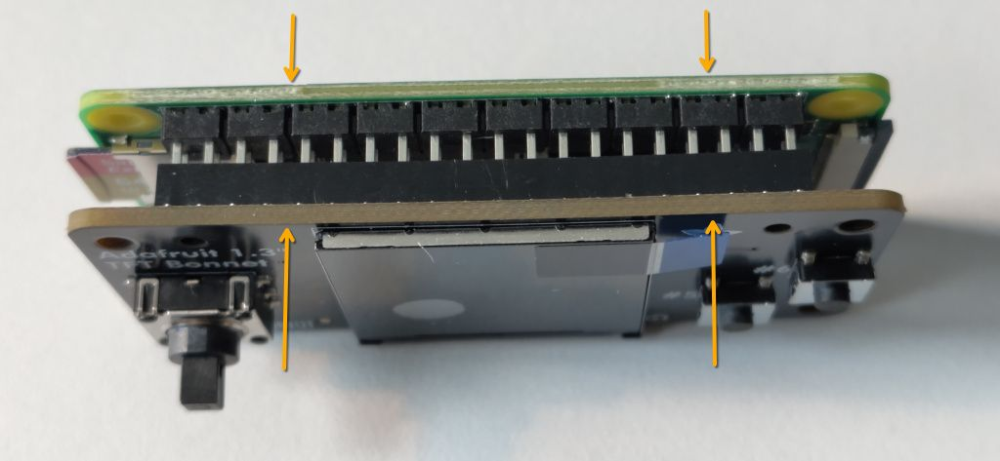{width=100%}

Une fois connectés, posez les deux cartes à plat et introduisez les entretoises
entre deux puis faîtes glisser une vis nylon à l'intérieur afin de maintenir les
entretoises en place.

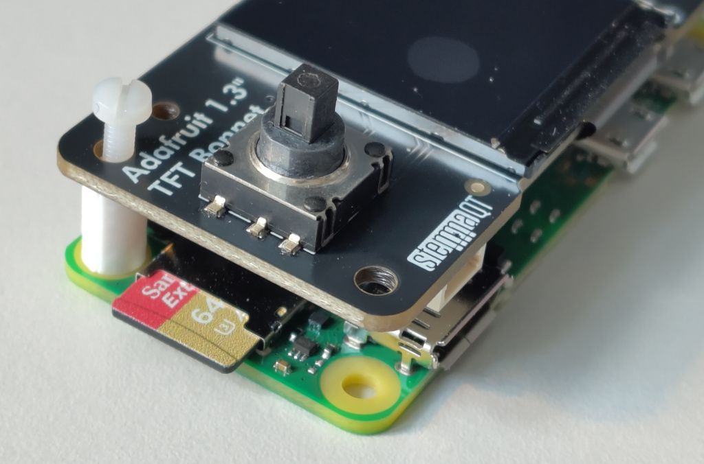{width=100%}

Répétez cette manipulation avec les 4 coins.

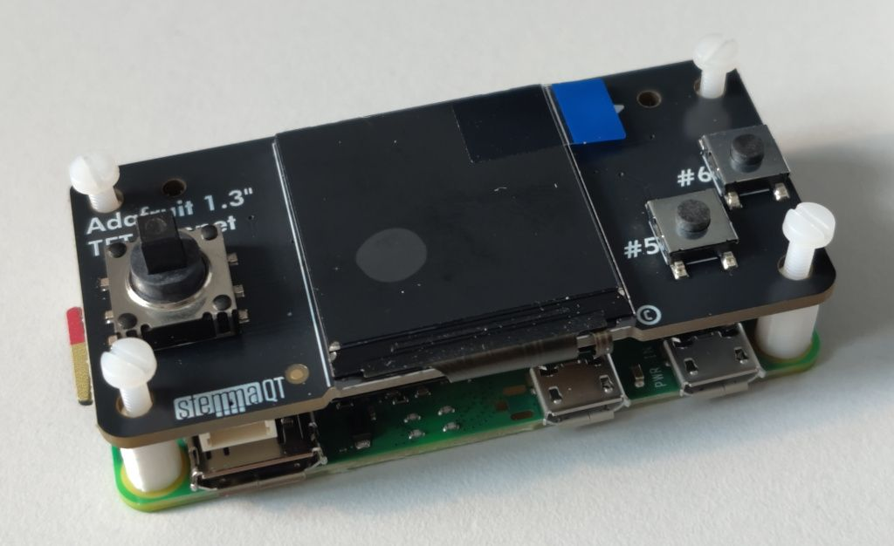{width=100%}

Vous pouvez dès à présent laisser de côté ce montage car nous allons maintenant
nous intéresser à la carte PiSugar 3.

### Assemblage temporaire et premier démarrage

Avant de se lancer plus loin dans le montage, il est judicieux d'effectuer le
tout premier démarrage de Contelia pour s'assurer que tout fonctionne comme
prévu. Si cette étape échoue, il est inutile d'aller plus loin.

Ici, évitez de toucher au bouton d'alimentation de la PiSugar. Bien qu'il y a
par défaut un systpèe de protection pour éviter d'allumer la carte par mégarde,
il vaut mieux éviter ce bouton tant que toutes les cartes ne sont pas
correctement vissées entre elles.

Positionnez la carte Raspberry Pi par dessus la carte PiSugar, tout en alignant
les vis. Les connecteurs de la carte PiSugar doivent s'appuyer proprement contre
les contactes de la carte Raspberry Pi.

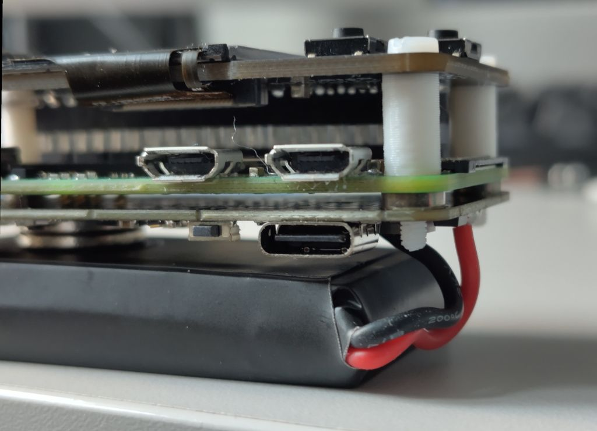{width=100%}

Serrez les vis en croix et assez fermement (mais pas trop non plus, il ne faut
pas abîmer les pas de vis).

Pour ce premier démarrage, je vous invite à brancher un câble d'alimentation
USB-C sur la carte PiSugar. BIen que la batterie devrait être suffisamment
chargée, il est plus sage de s'assurer que la tension électrique ne chute pas
pendant les étapes "critiques" de la première initialisation du Contelia OS.

**A EXPERIMENTER, MESURE LE TEMPS ET EXPLIQUER**

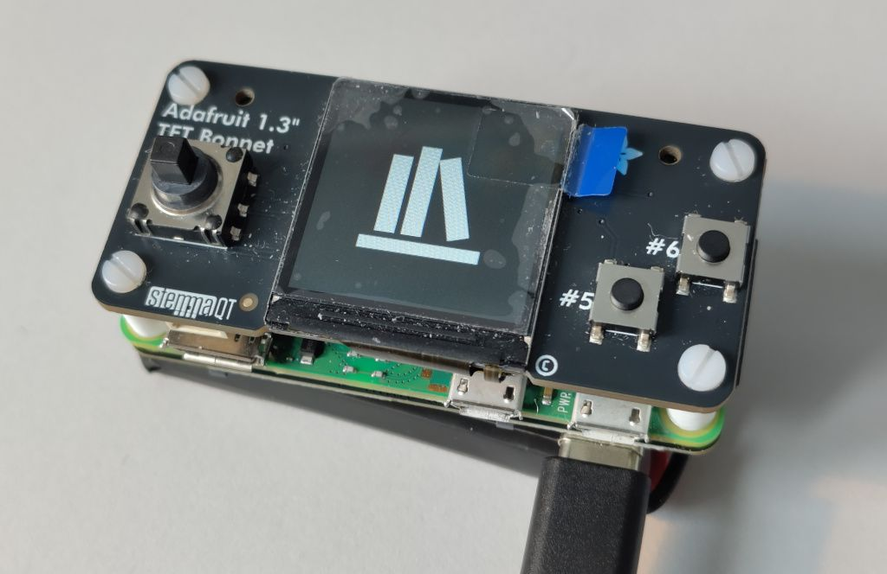{width=100%}

Attendez un instant, Carnotzet OS va s'éteindre de lui même puis débranchez le
câble USB-C et dévissez toutes les vis. Pour la suite, il est nécessaire de
monter la PiSugar séparément des deux autres cartes.

### Assemblage de la carte PiSugar 3

Avant tout, prennez la petite boîte et le bouton d'alimentation (en forme
rectangulaire). Introduisez le bouton dans la boîte depuis l'intérieur. Ce
bouton ne peut pas tenir en place tant que la carte PiSugar n'est pas installée.
Si vous souhaitez vous simplifier la vie, utilisez un morceau de papier collant
à l'extérieur afin de garder le bouton en place.

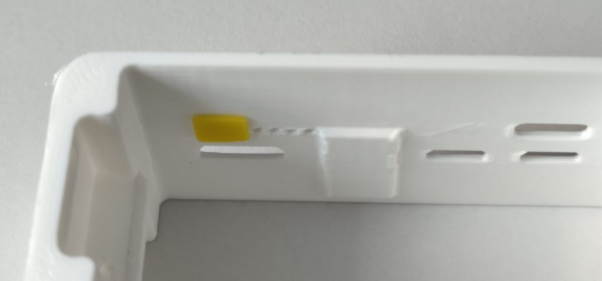{width=100%}

Regardez bien le sens de votre boîte, car vous devez insérer la carte PiSugar à
l'intérieur et depuis le bon côté. La carte PiSugar a uniquement un connecteur
USB-C et c'est elle qui a le bouton d'alimentation. Par rapport à la photo
ci-dessus, la carte PiSugar doit alors être insérée par le haut (car nous tenons
la boîte à l'envers).

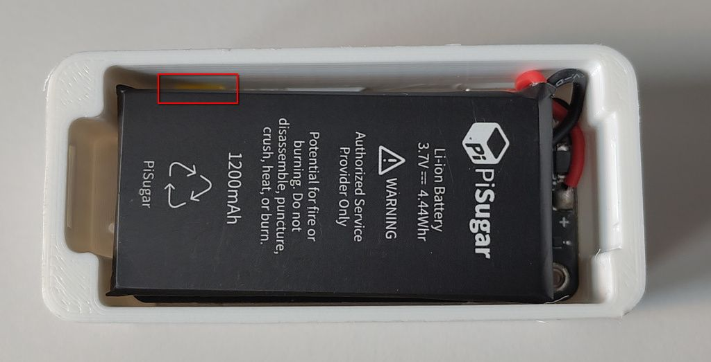{width=100%}

Vous devez glisser délicatement la carte PiSugar tout en faisant attention à ce
que le bouton d'alimentation se situe bien devant le bouton que vous avez
positionné précédemment avec du papier collant. Une fois fait, ne retournez pas
la boîte.

Saisissez la boîte en gardant appuyé avec un doigt, la carte PiSugar.

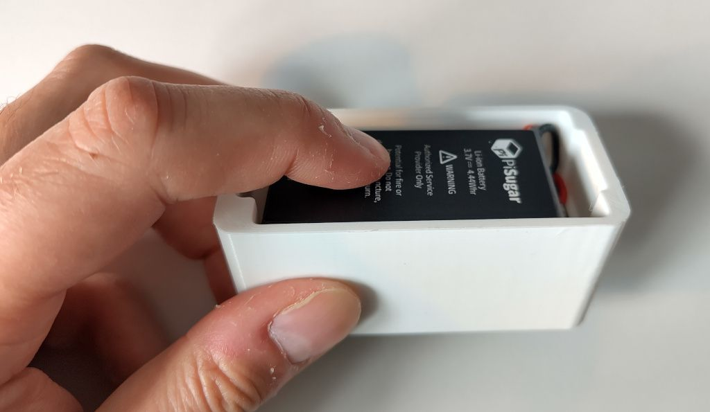{width=100%}

Alors vous ppuvez retourner l'assemblage pour y introduire de l'autre côté, la
paire de carte Raspberry Pi et Adafruit que vous avez préparé tout à l'heure.
Tout en gardant bien en place la carte PiSugar, introduisez les autres cartes.
Vous pouvez écarter légèrement les parois latérales de la boîte pour faciliter
leur introduction.

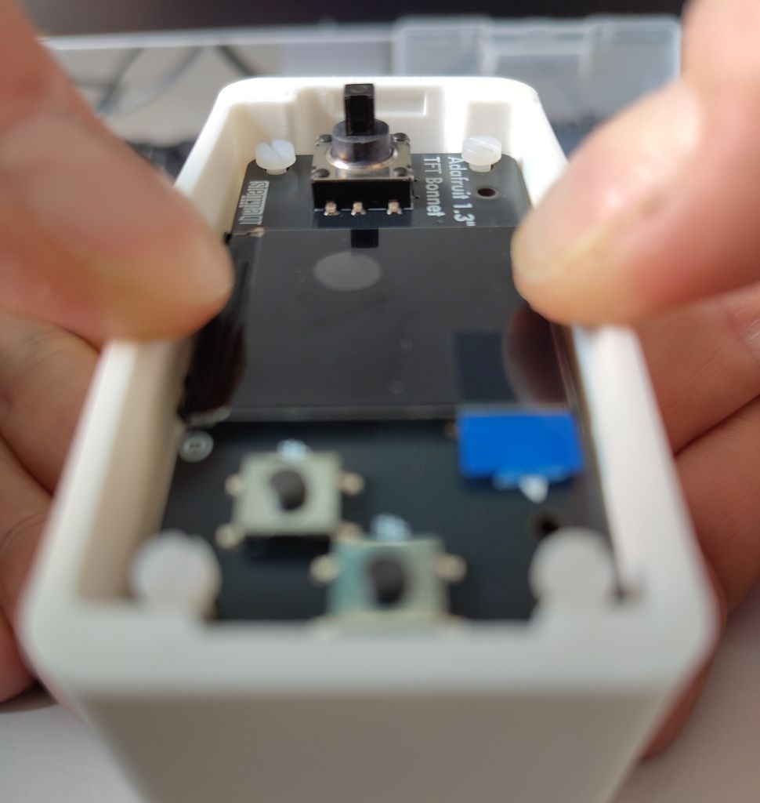{width=100%}

Faîtes en sorte d'introduire les cartes en les gardant à plat autant que
possible afin que les contactes entre la carte PiSugar et la carte Raspberry Pi
se fassent sans encombre. Une fois que vous avez bien introduit toutes les
cartes, les connecteurs de la carte Raspberry Pi (ainsi que le connecteur USB-C
de la PiSugar) devraient être alignés avec les trous du boîtier.

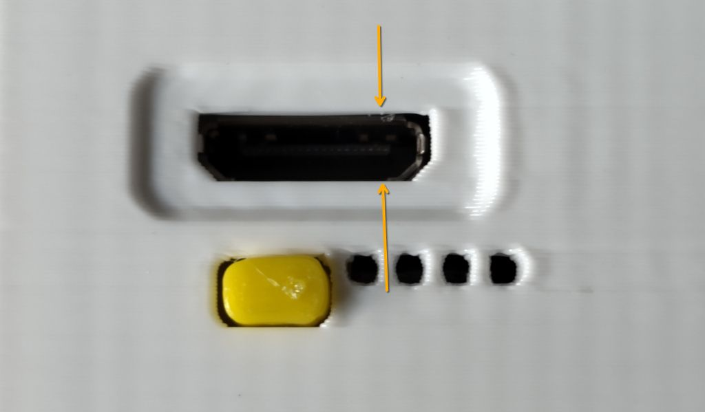{width=100%}

Tout en gardant bien en place avec une main, le trio de carte (je vous rappel
d'éviter autant que possible de presser sur l'écran de la carte Adafruit),
commencez par visser (en croix) les vis nylons. Vissez bien en croix et
gentiment afin que les cartes restent toujours bien plaquées. Ne serrez pas
comme un sourd car vous risqueriez d'abîmer le filetage des vis. Mais serrez
fermement car il faut garantir les appuis avec les contactes de la carte
Raspberry Pi.

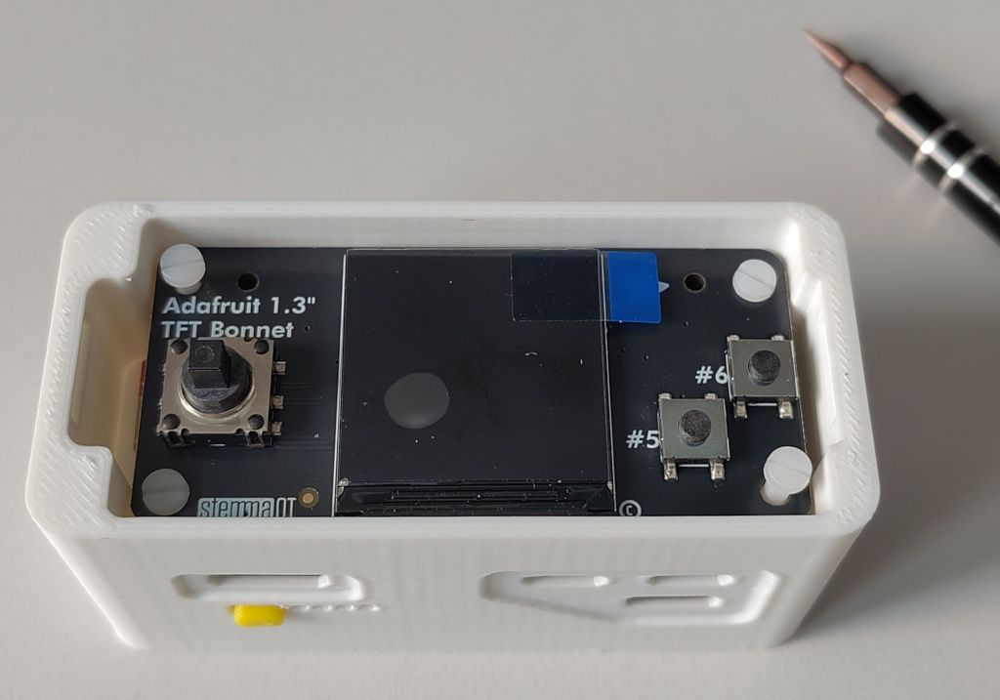{width=100%}

### Fermeture de la boîte à encaster

**Couvercle inférieure**

Vous avez deux couvercles à disposition. Le couvercle plein sert évidemment à
fermer l'ouverture sur la batterie.

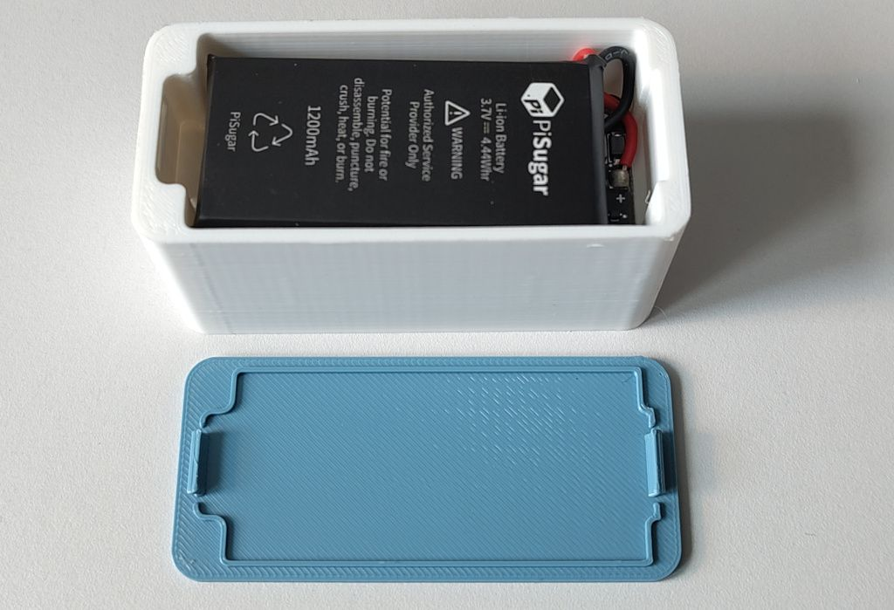{width=100%}

Faîtes tenir le couvercle au moins d'un côté court et maintenez comme sur la
photo avec une seule main. Utilisez votre seconde main pour courber (avec un peu
de force) légèrement le couvercle afin de faire rentrer le second clip.

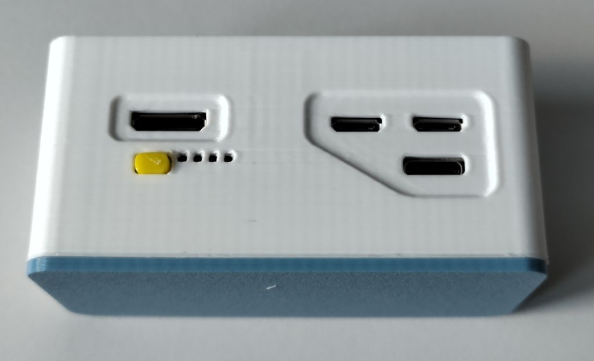{width=100%}

**Couvercle supérieure**

Avant tout, vous devez introduire la vitre en plastique transparent dans les
fentes du couvercle. Cette vitre est destinée à protéger l'écran des rayures.

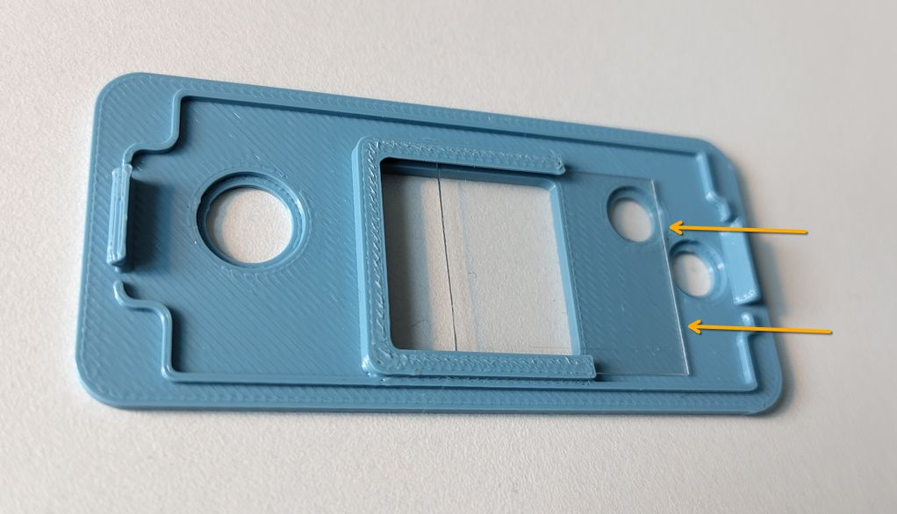{width=100%}

Poussez la vitre autant que possible. Elle ne doit pas obstruer un bouton et
elle doit complètement recouvrir le trou destiné à l'écran. Il est possible que
votre vitre ne soit pas exactement de la même dimension que sur la photo
ci-dessous.

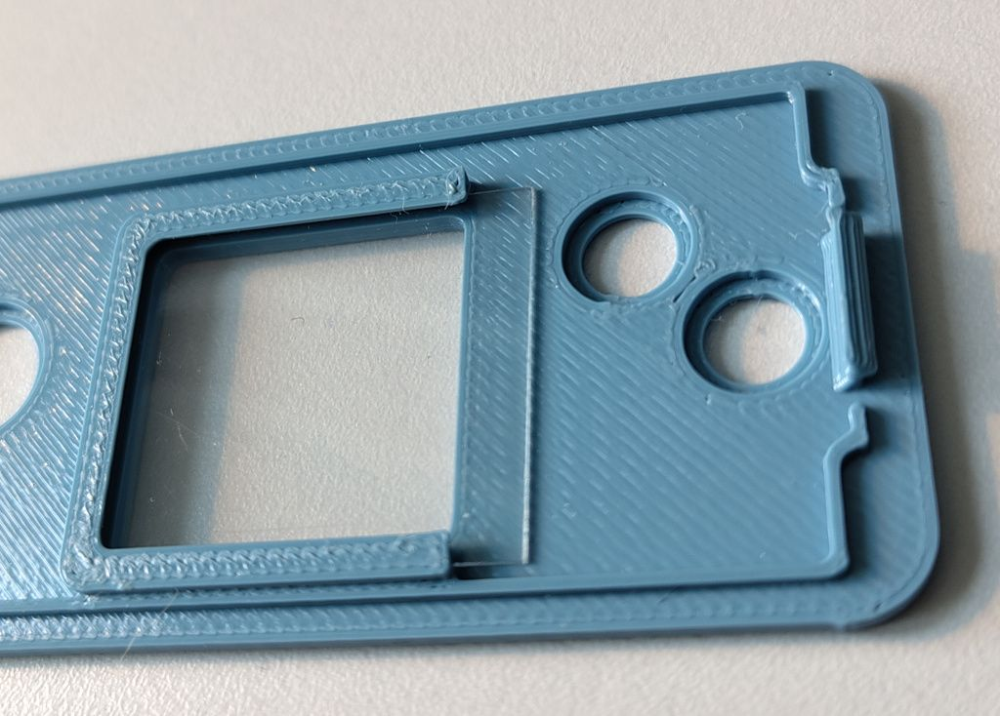{width=100%}

Maintenant il faut préparer la carte Adafruit avant de refermer la boîte.
Commencez par enfoncer le stick en caoutchouc. N'ayez pas peur de presser
fermement sur le stick car il peut y avoir une certaine résistance.

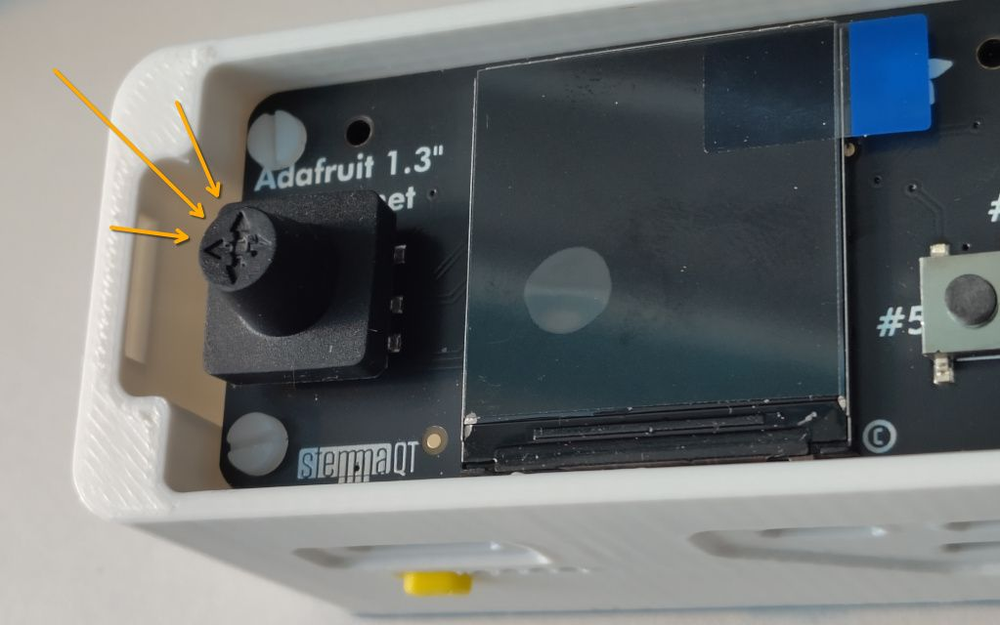{width=100%}

Une fois le stick en place, enlevez délicatement le film protecteur de l'écran.

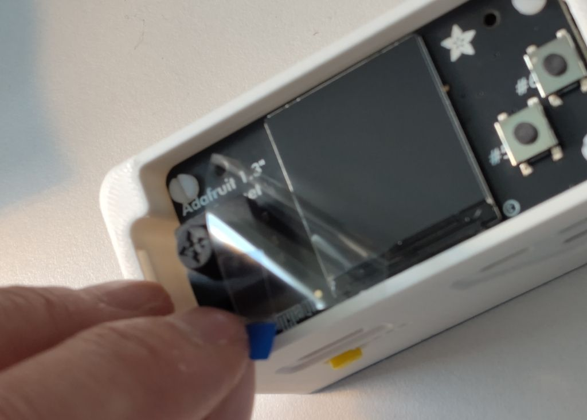{width=100%}

Déposez alors les deux boutons poussoir comme indiquez sur la photo. Si vous n'y
arrivez pas car c'est un jeu d'équilibrisme, vous pouvez procéder comme avec le
bouton d'alimentation en utilisant du papier collant en faisant tenir les
boutons directement sur le couvercle.

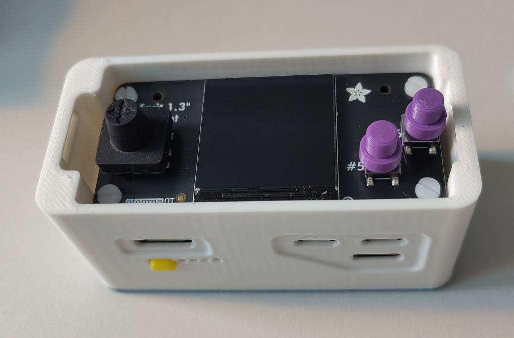{width=100%}

Fixer le couvercle supérieure de la même manière que pour le couvercle
inférieure.

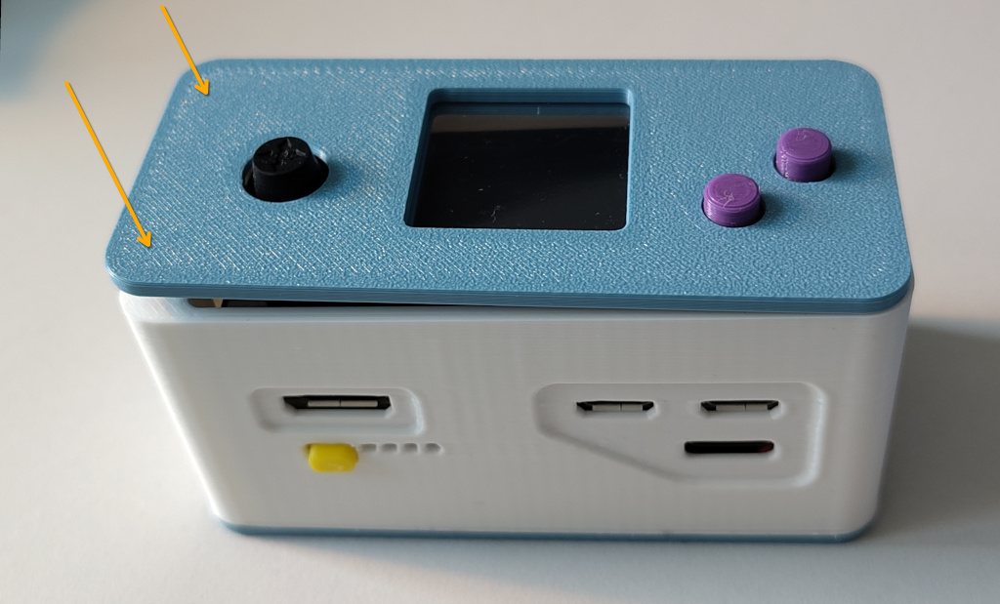{width=100%}

Votre petite boîte à histoire est prête.

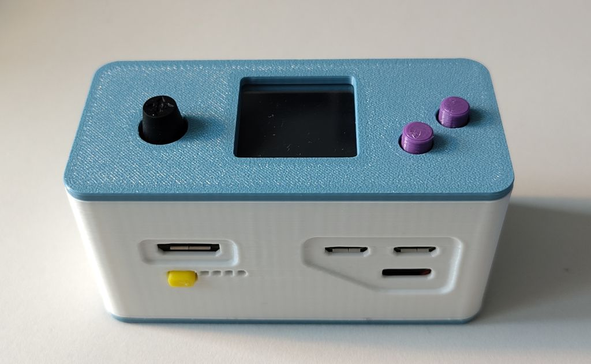{width=100%}

### Mise en place de la boìte principale

Tout d'abord, vous devez vous occupez du haut-parleur. Celui-ci utilise un
connecteur USB et il est donc tout à fait possible d'utiliser Contelia sans la
boîte principale. C'est votre boîte à histoire, vous en faites ce que vous
voulez. Vous pouvez imaginer utiliser uniquement des écouteurs USB, il est
également possible d'exploiter des enceintes (ou des écouteurs) bluetooth mais
nous y reviendrons dans la documentation utilisateur.

Vous devez enrouler proprement le câble USB du haut-parleur dans la bride en
forme de huit. Prennez votre temps, enroulez serrez.

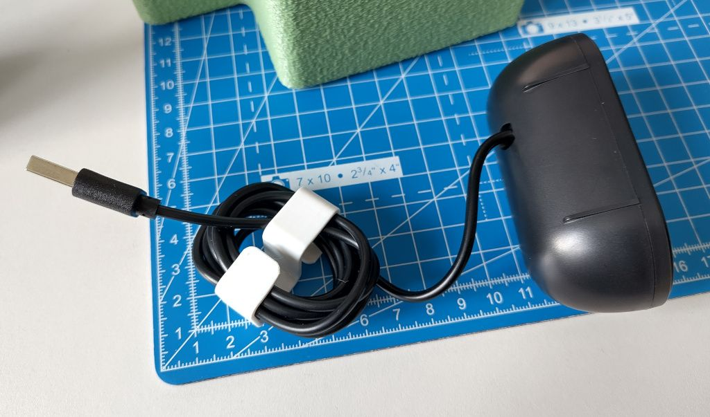{width=100%}

Prennez alors la boîte principale, la petite boîte ainsi que le haut-parleur.
Commencez par déposez la petite boîte en veillant bien à ce qu'elle soit
parfaitement encastrée. Le plaz du couvercle de la petit boi^te ne doit en aucun
cas dépasser la hauteur des parois de la grande boîte. Si c'est le cas, alors
certainement que vous n'avez pas bien positionnez la petite boîte.

Une fois fait, encastrez le haut-parleur dans son emplacement réservé en
veillant à ce que son câble sorte vers le bas et non vers le haut. Disposez le
câble comme proposé sur la photo.

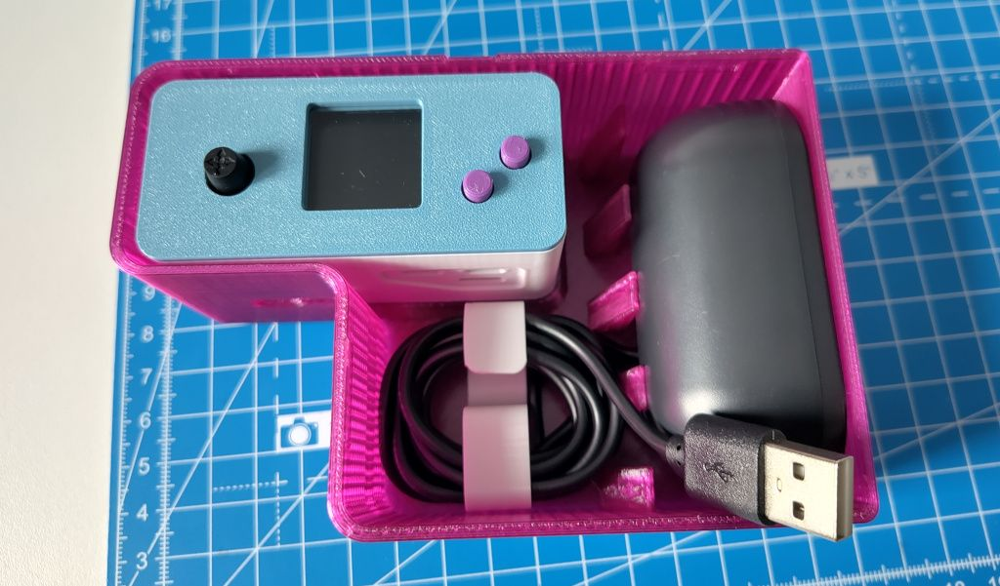{width=100%}

Il ne vous reste alors plus qu'un câble, c'est l'adapteur USB $ micro-USB. Je
vous inv^te à enrouler le câble de l'adaptateur et d'utiliser les brides noirs
pour faire tenir la boucle. Observez bien la photo suivante. Connectez le
micro-USB de l'adaptateur sur l'entrée **gauche** de la petit boîte à histoire.
L'entrée micro-USB droite supérieure n'est **jamais** utilisée. Mettez alors
bien en place le câble de l'adaptateur afin de pouvoir le connecter avec le
câble USB du haut-parleur sans que ça puisse empêcher de fermer le couvercle de
la grande boîte à histoire.

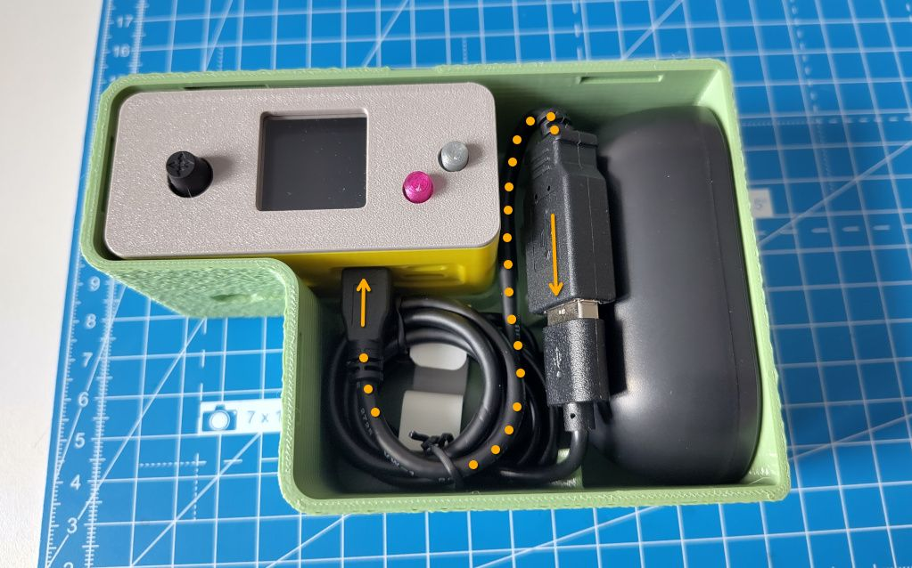{width=100%}

Si la batterie est complètement chargée, alors vous pouvez mettre le couvercle
en place. Commencez par en haut à gauche et terminez de clipper en bas à droite.

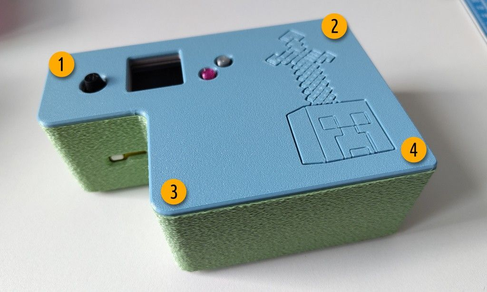{width=100%}

[balenaEtcher]: https://etcher.balena.io/
