## Contelia

Contelia est conçu sous la forme de deux boîtes imbriquées. La boîte principale
contient la boîte à histoires ainsi qu'une paire de haut-parleurs USB permettant
directement l'écoute.

Pour ouvrir la boîte, cherchez un petit décrochement au centre du côté le plus
long et qui vous permet, avec un ongle, de séparer le couvercle. Celui-ci est
maintenu avec l'aide de clips.

> Si vous vous demandez pourquoi est-ce important de savoir ouvrir la boîte,
> c'est tout simplement pour pouvoir la recharger. En effet, il n'est pas
> possible d'accéder au connecteur USB-C tant qu'elle est fermée. Voir la
> section [Recharger la batterie](#recharger-la-batterie).

La boîte à histoires est simplement posée à l'intérieur de la boîte principale.
Le câble USB enroulé sert uniquement à relier les haut-parleurs à la boîte à
histoires.

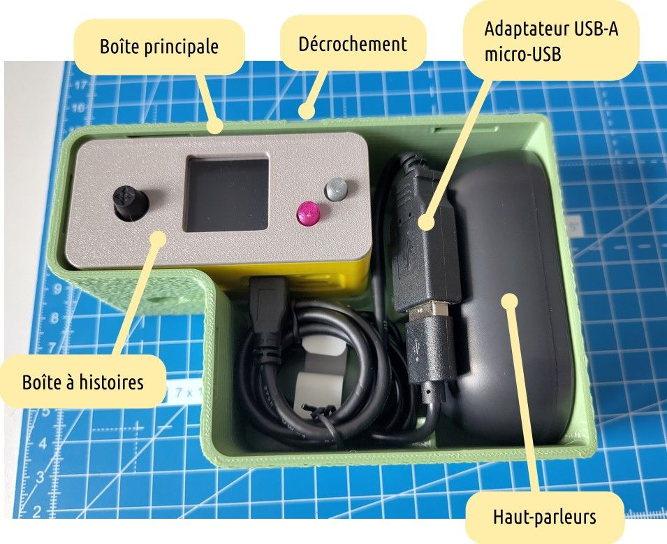{width=100%}

Observez bien les connecteurs de la boîte à histoires. Il est important de
toujours brancher les haut-parleurs sur le connecteur micro-USB de gauche.
Le connecteur mini-HDMI n'est pas utile aujourd'hui (à par pour les bidouilleurs).
Mais il sera utilisé dans une version ultérieure du logiciel et qui
permettra d'exploiter Contelia autrement. A propos du connecteur micro-USB
de droite (avec la croix rouge dans l'image ci-dessous), vous pouvez le considérer
comme étant inutilisé.

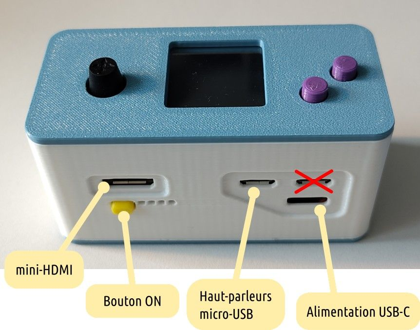{width=100%}

> Ne branchez pas les haut-parleurs sur le connecteur micro-USB de droite car
> ça ne fonctionnera pas.

### Recharger la batterie

Pour recharger Contelia, vous devez utiliser un câble USB-C (ce câble ainsi
que le chargeur ne sont pas livrés avec Contelia). C'est le câble
que l'on utilise habituellement avec un téléphone mobile. Le connecteur est
clairement indiqué sur l'image précédente, c'est l'alimentation USB-C. Vous
pouvez ainsi utiliser le même chargeur que pour votre téléphone.

Pendant la charge, Contelia peut être utilisé tout à fait normalement. Contelia
est configuré pour protéger la batterie. Ce qui veut dire qu'elle ne sera
jamais chargée à plus de 80% de sa capacité. Bien que cela entraîne une baisse
d'autonomie, cette protection permet de prolonger sa durée de vie.

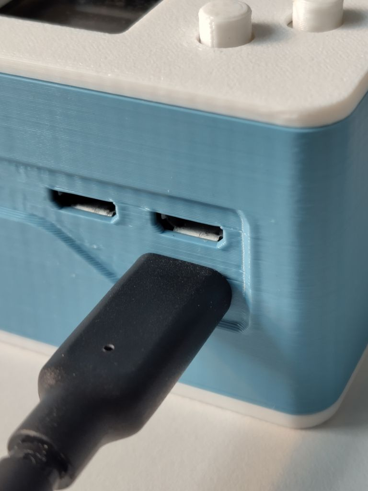{width=35% fig-align="center"}

Bien que Contelia peut être utilisé pendant la charge, Si la
batterie est complètement déchargée, il est nécessaire d'attendre
au moins une minute ou deux avant de pouvoir allumer la boîte à histoires.

> Notez bien qu'il est possible de changer une batterie usagée en cas de
> diminution trop impactante de l'autonomie. L'opération nécessite quand même
> l'utilisation d'un fer à souder.

Tant que Contelia est connecté à une alimentation externe par l'USB-C, des
lumières vertes vont clignoter de gauche à droite. Cet indicateur ne permet
pas vraiment de savoir quand la charge est complète même si le clignotement
se fait avec les 4 lumières. Un meilleur indicateur est de simplement mettre
la main sur le chargeur USB-C. Si après un certain temps, celui-ci n'est plus
chaud, c'est qu'il ne charge plus rien et que vous pouvez alors le déconnecter.

## Premier démarrage

Le premier démarrage (**si aucun livre n'est chargé**) va simplement vous montrer
l'écran suivant qui signifie que Contelia est en attente de livres.

{width=20% fig-align="center"}

Dans le cas contraire, le premier livre va s'afficher et (s'il y en a plus d'un)
vous pouvez naviguer très simplement dans les livres (voir la section
«&nbsp;[Navigation dans les menus](#navigation-dans-les-menus)&nbsp;» pour plus
de détails).

## Chargement des histoires

Contelia ne sert à rien sans contenu. Mais le contenu n'est bien
souvent pas disponible gratuitement. En cherchant bien, il existe
quelques projets communautaires et de plus, si vous avez déjà une boîte à
histoires Lunii, il est possible de les charger sur Contelia (attention, cela
ne concerne pas la Flam).

### Lunii

Si vous n'avez pas de boîte à histoires Lunii, vous pouvez sauter ce chapitre
et directement passer au chapitre « [Communautaire](#communautaire) ».

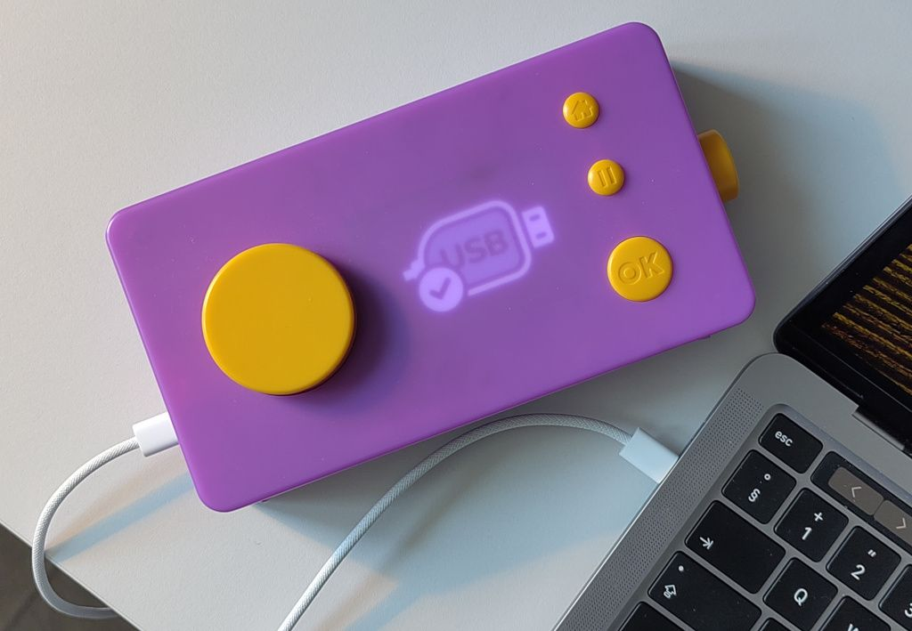{width=100%}

Récupérer les histoires que vous avez acheté avec la Lunii fait sens. Pour cela
il faut brancher la Lunii à votre ordinateur, un nouveau périphérique devrait
s'afficher en tant que disque USB.

| macOS | Windows |
| --- | --- |
| Vous devez autoriser ce périphérique. ||
| 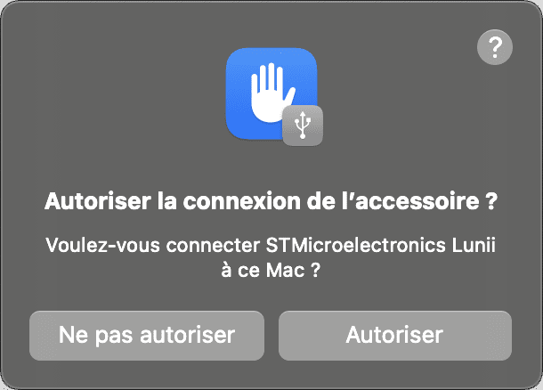{width=100%} ||
| Alors une nouvelle icône de disque devrait apparaître sur le bureau de votre Mac. | Un nouveau lecteur de disque devrait se monter dans l'explorateur de fichiers. |
| 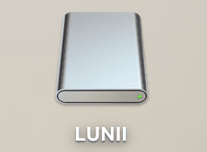{width=100%} | 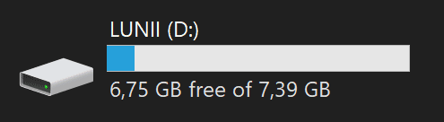{width=100%} |

L'ouverture de ce disque va vous montrer différents fichiers. Il va falloir
(sous macOS et Linux) afficher les fichiers cachés afin de mettre la main sur
les histoires de votre Lunii.

| macOS | Windows |
| --- | --- |
| 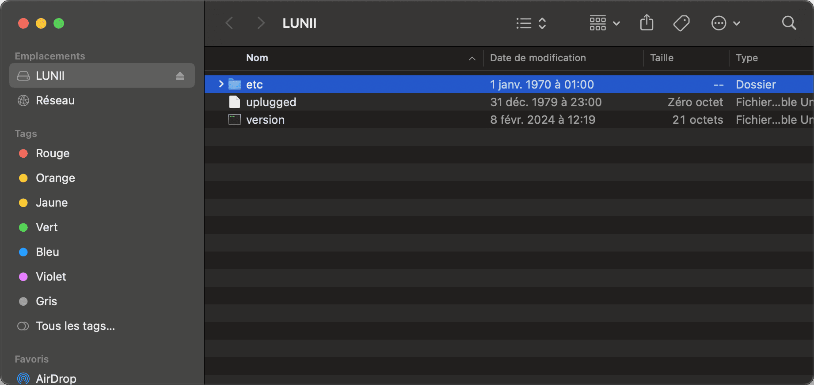{width=100% .lightbox} ||
| Faîtes  pour révéler les fichiers cachés. | Sous Windows, il n'est pas nécessaire de forcer l'affichage des fichiers cachés. |
| 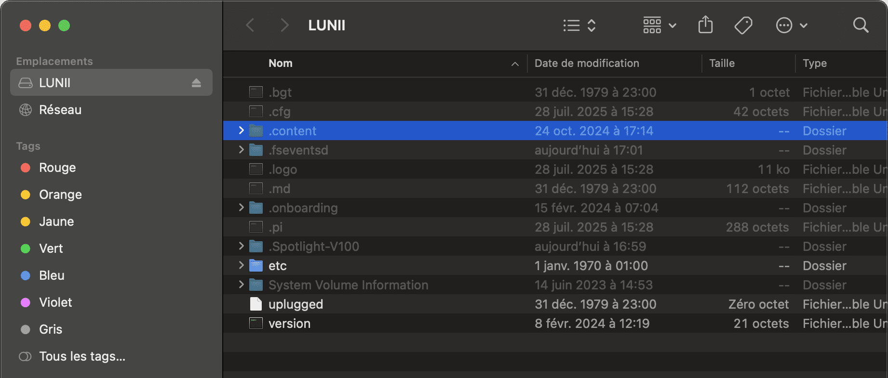{width=100% .lightbox} | 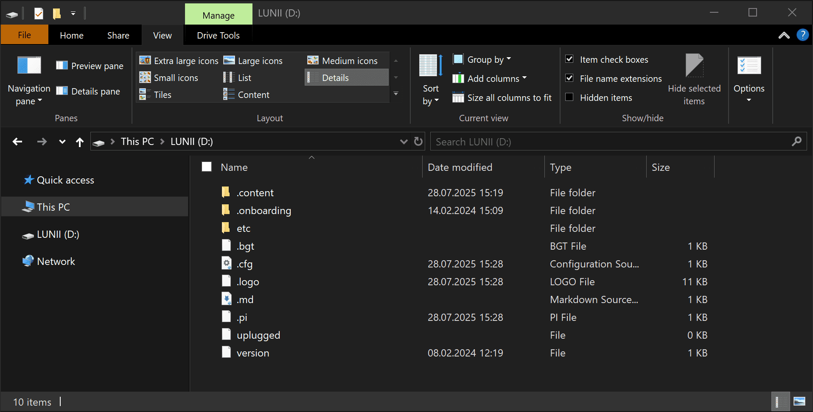{width=100% .lightbox}|

Cherchez le dossier nommé `.content` car c'est lui qui contient toutes vos
histoires. Dedans vous trouverez une liste de dossiers avec des noms cryptiques.

| macOS | Windows |
| --- | --- |
| 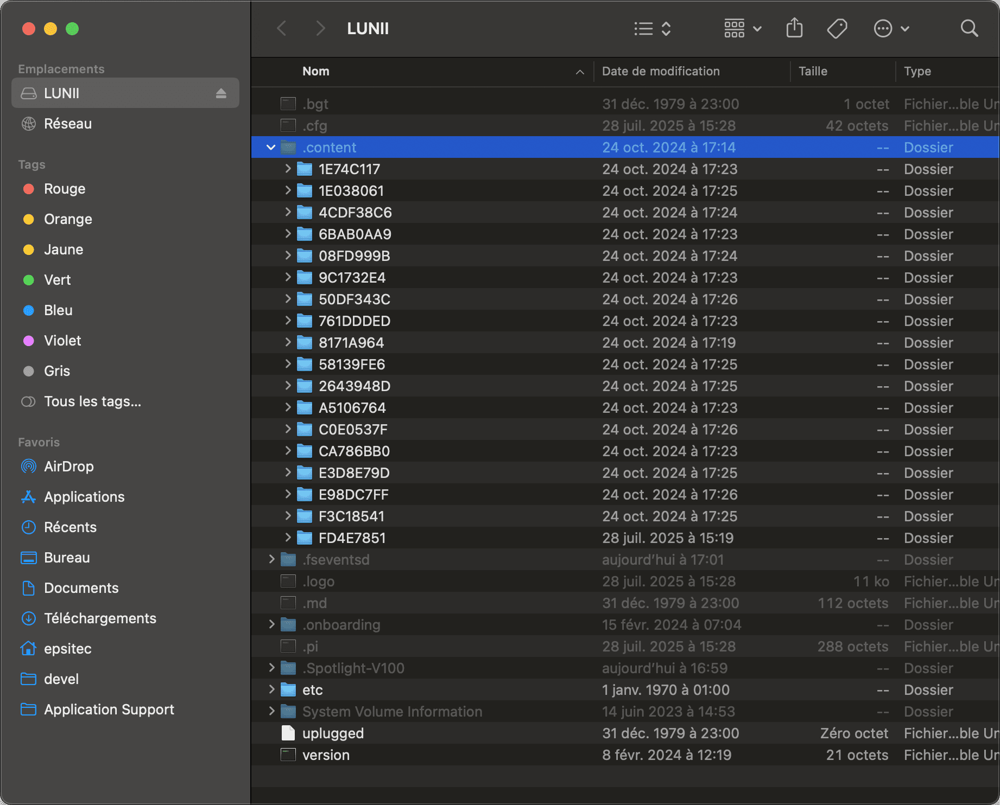{width=100% .lightbox} | 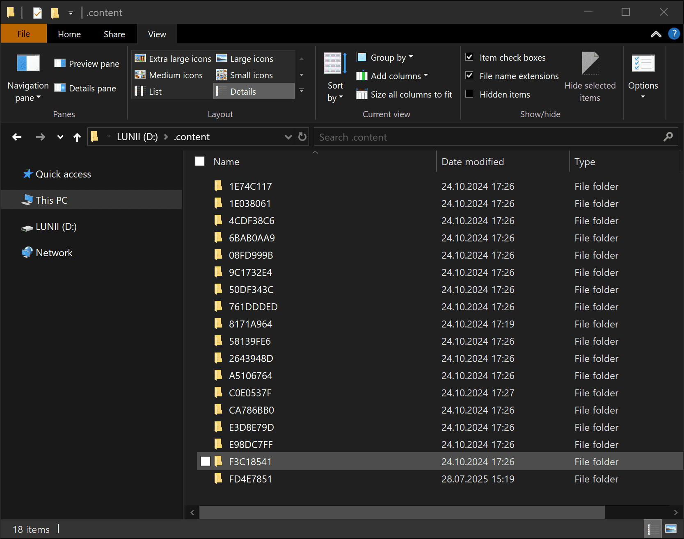{width=100% .lightbox} |

Copiez le dossier `.content` sur le disque de votre ordinateur (par exemple sur
le bureau). Une fois la copie terminée, je vous invite à éjecter la Lunii car
nous avons désormais tout ce qu'il nous faut.

| macOS | Windows |
| --- | --- |
| Depuis le Finder | Depuis la barre de statut |
| 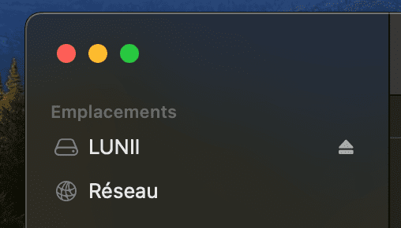{width=100% .lightbox} | 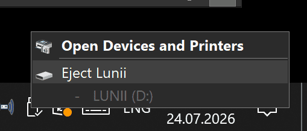{width=100% .lightbox} |

Ouvrez le dossier `.content` que vous avez transféré sur votre bureau. Dedans il
y a un dossier par histoire. Pour chaque dossier, créez un fichier ZIP. Ce sont
ces fichiers ZIP qui pourront être chargés dans la boîte à histoires Contelia.

| macOS | Windows |
| --- | --- |
| 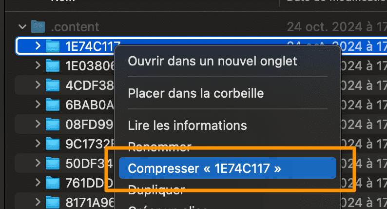{width=100% .lightbox} | 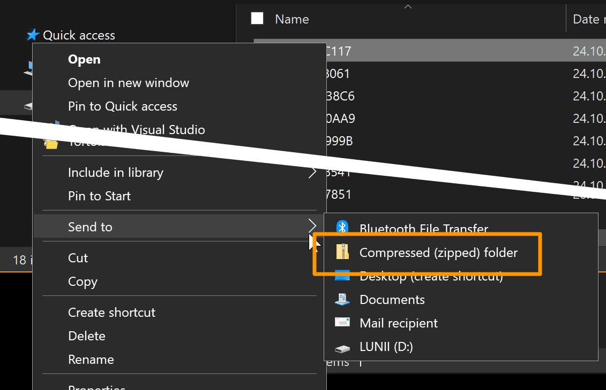{width=100% .lightbox} |

Ne vous inquiétez pas des noms car une fois chargé dans Contelia, les images
de chaque histoire permettront de les identifier clairement.

### Communautaire

Il existe des packs d'histoires disponibles gratuitement dans une communauté
francophone que vous pouvez rejoindre par l'intermédiaire du
[logiciel Discord][1]. Cette communauté met à disposition de nombreux livres,
donne des conseils, de l'aide et sert également de vitrine pour de nombreux
autres projets qui partage le même esprit que Contelia, c'est à dire d'offrir
des alternatives aux boîtes à histoires Lunii, etc. Que ce soit du matériel
dédié ou du "recyclage" de smartphones en liseuses pour enfants.

Vous y trouverez également toute l'aide nécessaire pour pouvoir créer vos
propres histoires si le cœur vous en dit.

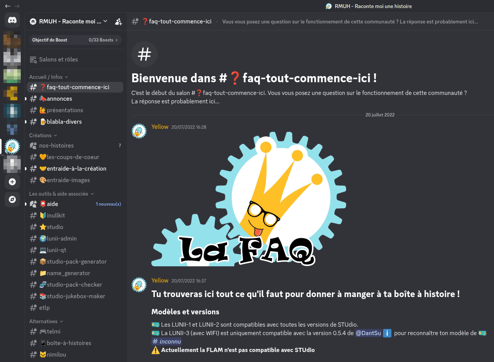{width=80% fig-align="center" .lightbox}

L'utilisation du logiciel Discord est discutable, mais c'est le seul moyen de
pouvoir accéder à cette communauté. Les livres téléchargeables chez eux peuvent
être directement exploités dans Contelia. Je vous encourage fortement d'y aller
faire un tour car leur bibliothèque est plutôt impressionnante.

### Charger des histoires

Pour charger des histoires, vous devez mettre Contelia en mode configuration.
Avant tout, il est recommandé de brancher le connecteur d'alimentation (charge)
pour garantir que les transferts ne soient pas interrompus.

Pour activer le mode configuration vous devez effectuer la combinaison de boutons
suivante&nbsp;:

1. Tenez le joystick vers le **bas** (ne lâchez pas)
2. Pressez **simultanément** les deux boutons
3. Relâchez tout

Pour quitter ce mode, procédez exactement de la même manière.

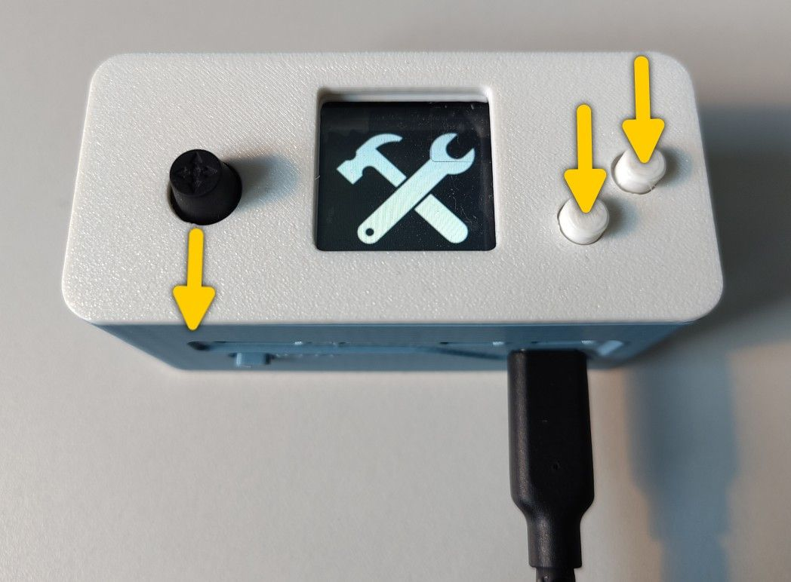{width=100%}

Si vous voyez bien le même écran que sur la photo ci-dessus, alors le mode
configuration est activé et vous pouvez procéder aux modifications des histoires
qui sont actuellement sauvegardées dans votre boîte à histoires.

A partir de maintenant, Contelia est en mode portail captif (captive portal).
Cela veut dire qu'un nouveau réseau Wifi est apparu et se nomme Contelia.
Vous pouvez alors utiliser un ordinateur ou un smartphone pour vous connecter
à ce nouveau réseau. En vous connectant, votre ordinateur devrait vous proposer
d'accéder à la page de connexion du réseau Contelia. Cette page permet de
modifier le contenu de votre boîte à histoires.

Si votre ordinateur ne vous propose rien, ouvrez votre navigateur internet.
Si le navigateur internet ne propose pas d'accéder au portail captif, alors
entrez l'adresse de n'importe quel site internet et vous serez automatiquement
redirigé sur la page de configuration de Contelia.

> Bien entendu, quand vous êtes connecté au Wifi Contelia, vous ne pouvez plus
> utiliser votre réseau Wifi habituel et donc vous ne pouvez plus utiliser
> internet. Cela implique que vous avez déjà préparé dans votre ordinateur (ou
> votre smartphone), les histoires que vous souhaitez charger dans Contelia.

#### Portail

Le portail (ou gestionnaire) Contelia se présente sous la forme d'un formulaire
permettant de charger une histoire au format ZIP, puis de modifier le contenu
actuellement disponible dans la boîte à histoires. L'utilisation de cette
page devrait être auto-explicative. Certaines actions nécessites de cliquer
sur le bouton "Appliquer les modifications" pour que ce soit pris en compte.

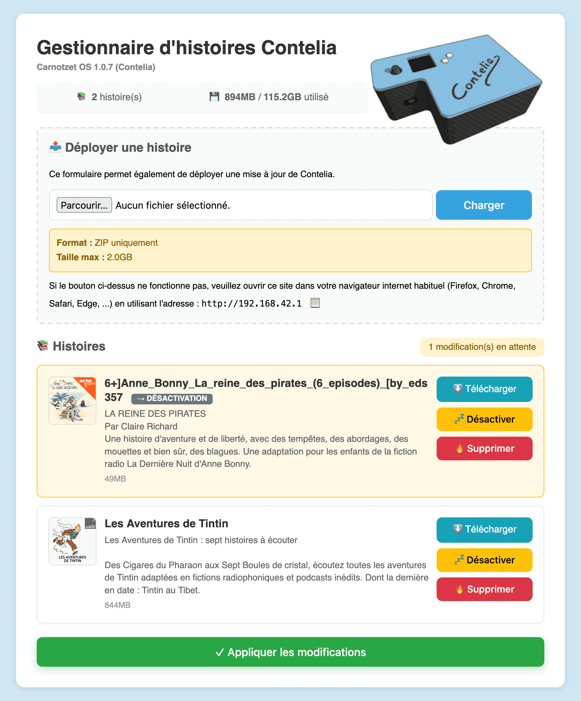{width=100%}

Dans la copie d'écran ci-dessus on peut voir que Contelia contient deux
histoires et que l'utilisateur a choisi de désactiver l'une d'elle.

**Fonctionnalités**

- Charger une nouvelle histoire avec le formulaire en tête de page
- Télécharger une histoire depuis la boîte à histoires
- Désactiver une histoire pour la garder dans la boîte à histoire mais sans
  la rendre visible
- Supprimer une histoire

> Il n'est (pour le moment) pas possible de modifier l'ordre des histoires.

## Navigation dans les menus

Au démarrage, Contelia montre le premier livre ([s'il y en a au moins un](#premier-démarrage)).
La bouton directionnel (joystick) permet alors de se déplacer de livre en livre
en utilisant les directions gauche et droite.

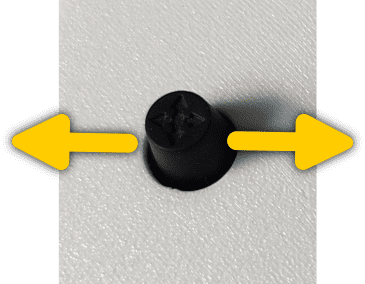{width=30% fig-align="center"}

---

:::: {layout="[20,5,75]"}

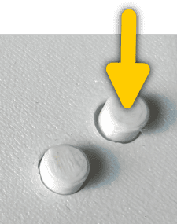

&nbsp;

Une fois le livre choisis, le bouton de droite permet de l'ouvrir. C'est le
bouton de confirmation. Dès ce moment, la navigation se fait dans le livre et
dépend directement du livre en question. Par exemple il peut y avoir une étape
pour choisir un personnage, puis une prochaine étape pour choisir un objet et
enfin l'histoire commence. Notez bien que la navigation dans un livre dépend de
celui qui l'a créé.

&nbsp;

&nbsp;

---

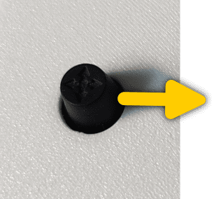

&nbsp;

Lorsque l'histoire commence, l'écran s'éteint automatiquement pour laisser place
uniquement à la narration. Pendant la lecture, un mouvement vers la droite avec
le bouton directionnel, permet de mettre la lecture en pause. Effectuer à
nouveau ce même mouvement va permettre de continuer la lecture.

&nbsp;

&nbsp;

---

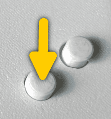

&nbsp;

Pour quitter la lecture sans atteindre la fin de l'histoire, il est possible
d'utiliser le bouton de gauche qui va alors permettre de revenir dans le menu
du livre. C'est en quelque sorte le bouton de retour en arrière.
Chaque pression du bouton de gauche va faire remonter dans la navigation.
Ainsi il est possible d'atteindre le menu principal pour choisir un autre livre.

&nbsp;

&nbsp;

---

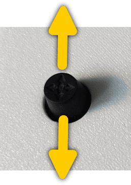

&nbsp;

Le dernier mouvement important concerne le réglage du volume. Pour cela il
faut utiliser les mouvements haut et bas du joystick. Plus le volume est élevé,
et plus la consommation de la batterie sera importante. Contelia est configuré
avec une limitation interne afin d'éviter un volume excessif.

::::

## Éteindre Contelia

Contelia s'éteint automatiquement après 20 secondes d'inactivité. Ce qui signifie
que si aucune histoire est en cours de lecture et qu'aucune action n'est effectuée
dans le menu, alors Contelia s'arrête.

Il y a deux exceptions. Quand Contelia est en mode configuration pour la
modification des histoires ou en configuration du Bluetooth, celle-ci reste
active indéfiniment.

> Il est possible de forcer l'extinction de Contelia en tenant pressé le bouton
> d'alimentation pendant plus de 2 secondes.

## Audio

Contelia peut être utilisée en dehors de sa boîte principale et sans les
haut-parleurs USB. Ce chapitre vous présente deux possibilités. Mais sachez
que vous ne pouvez pas connecter directement un câbles analogique de type
jack. Si c'est nécessaire pour vous, il vous faudra acheter un adaptateur
jack → USB.

### Casque audio USB

Vous pouvez brancher un casque USB (à la place des haut-parleurs d'origine)
directement avec l'adaptateur USB fourni (dans la boîte principale).

[IMAGE]

Si vous avez un casque USB avec dongle (pour le sans-fil), vous pouvez brancher
le dongle de la même manière.

### Bluetooth

Contelia possède tout le nécessaire pour transmettre la lecture des histoires
par Bluetooth. Elle devrait fonctionner directement avec les casques sans-fils,
les haut-parleurs sans-fils ainsi que les voitures.

Pour activer le mode Bluetooth vous devez effectuer la combinaison de boutons
suivante&nbsp;:

1. Tenez le joystick vers le **haut** (ne lâchez pas)
2. Pressez **simultanément** les deux boutons
3. Relâchez tout

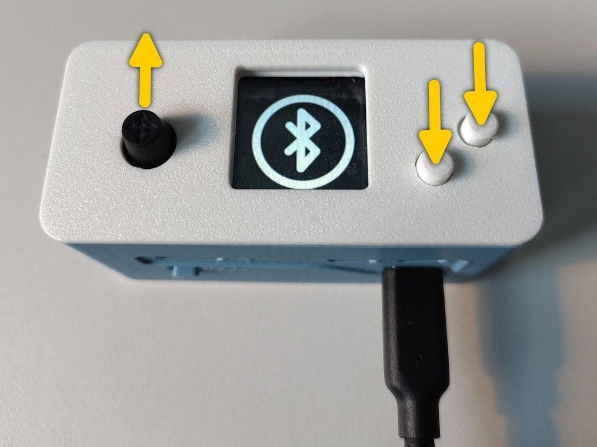{width=100%}

> Pour quitter ce mode, procédez exactement de la même manière.

Pendant l'activation de ce mode, un sablier peut s'afficher sur l'écran. Une
fois que le Bluetooth est actif, le symbole Bluetooth s'affiche à la place du
sablier et des périphériques audio vont être recherchés (scannés) à proximité.

Pour qu'un périphérique soit détecté, il doit impérativement être en mode
d'appairage.

| 1. Activation | 2. Scan | 3. Détection |
| --- | --- | --- |
| {width=60%} | {width=60%} | {width=60%} |

Tant que l'image du scan persiste, c'est que Contelia ne trouve aucun périphérique
audio disponible (ou compatible) à proximité. Si la détection réussi, vous
pouvez presser le bouton de droite afin de confirmer. Dès ce moment là, les
histoires seront lues à travers le périphérique Bluetooth.

> Veuillez noter que le Bluetooth est toujours désactivé si Contelia a été
> éteint. Il est alors nécessaire de reproduire à nouveau cette procédure
> d'appairage.

Quand vous utilisez le Bluetooth, c'est une bonne idée de séparer la boîte
à histoires des haut-parleurs USB afin de gagner en autonomie. En effet, dès le
moment que les haut-parleurs USB sont branchés, même s'ils ne sont pas utilisés
pour le son, ils vont consommer de l'énergie inutilement.

[1]: https://monurl.ca/lunii.creations